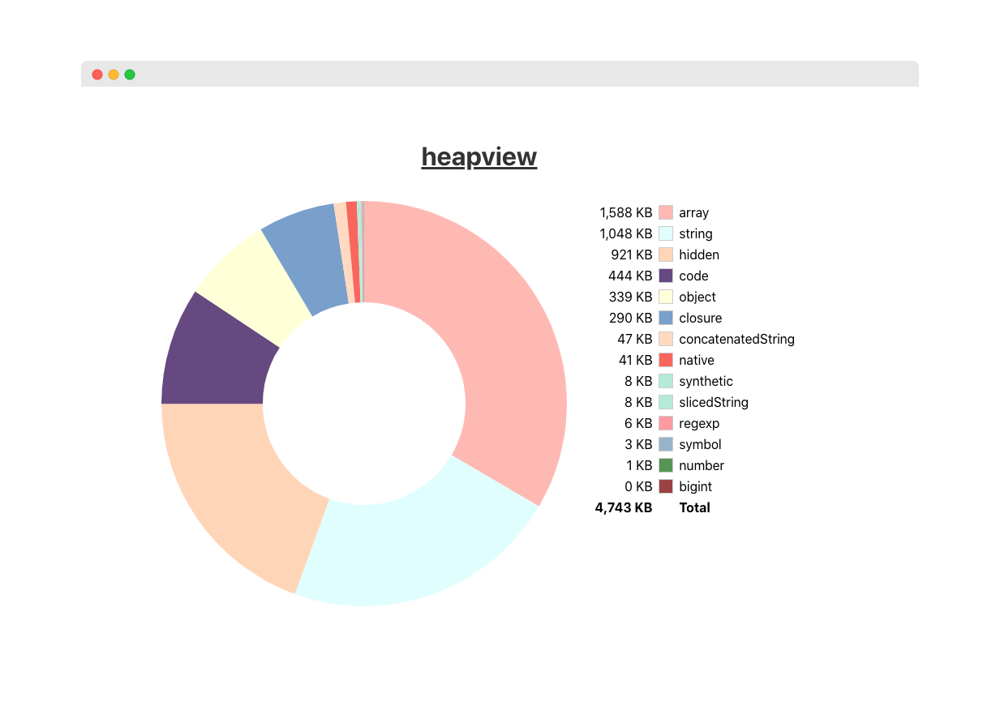

> node heap dump visualizer

[![License][license-image]][license-url]
[![Developed at Klarna][klarna-image]][klarna-url]

Heapview is a tool to help you out in [post mortem debugging scenarios](#post-mortems).

It's currently under development.



## Developing

You'll need [Rust](https://www.rust-lang.org/tools/install) to build the parser and server and [Node](https://github.com/nvm-sh/nvm) if you wanna work on the UI.

```sh
# For backend
cargo run <PATH_TO_FILE>
```

## Running the UI

To show the chart in the browser, you can start development server:

```
cd heapview/src/ui/
yarn install
yarn start
```

## Roadmap

#### Realistic

- Display all nodes and allow search by type, content, etc;
- Automatically group objects based on similarity;
- Display a proper TreeMap of everything;

#### Sci-fi

- If given a package.json, try and figure which objects come from which deps and general dep weight.
- TBD

## Post mortems

Post mortem debugging usually happens when you can't inspect your processes directly, for instance, when you're running microservices.

In these cases you will have to first produce some heap dumps. One good lib to do so is [heapdump](https://www.npmjs.com/package/heapdump). It uses v8 cpp bindings to do so in older versions of node. Since [11.13](https://nodejs.org/api/v8.html#v8_v8_getheapsnapshot), you can do it in JS by running `v8.getHeapSnapshot()`.

## How to contribute

See our guide on [contributing](.github/CONTRIBUTING.md).

## Release History

See our [changelog](CHANGELOG.md).

## License

Copyright © 2020 Klarna Bank AB

For license details, see the [LICENSE](LICENSE) file in the root of this project.

<!-- Markdown link & img dfn's -->

[ci-image]: https://img.shields.io/badge/build-passing-brightgreen?style=flat-square
[ci-url]: https://github.com/klarna-incubator/TODO
[license-image]: https://img.shields.io/badge/license-Apache%202-blue?style=flat-square
[license-url]: http://www.apache.org/licenses/LICENSE-2.0
[klarna-image]: https://img.shields.io/badge/%20-Developed%20at%20Klarna-black?labelColor=ffb3c7&style=flat-square&logo=data:image/png;base64,iVBORw0KGgoAAAANSUhEUgAAABAAAAAOCAYAAAAmL5yKAAAAAXNSR0IArs4c6QAAAIRlWElmTU0AKgAAAAgABQESAAMAAAABAAEAAAEaAAUAAAABAAAASgEbAAUAAAABAAAAUgEoAAMAAAABAAIAAIdpAAQAAAABAAAAWgAAAAAAAALQAAAAAQAAAtAAAAABAAOgAQADAAAAAQABAACgAgAEAAAAAQAAABCgAwAEAAAAAQAAAA4AAAAA0LMKiwAAAAlwSFlzAABuugAAbroB1t6xFwAAAVlpVFh0WE1MOmNvbS5hZG9iZS54bXAAAAAAADx4OnhtcG1ldGEgeG1sbnM6eD0iYWRvYmU6bnM6bWV0YS8iIHg6eG1wdGs9IlhNUCBDb3JlIDUuNC4wIj4KICAgPHJkZjpSREYgeG1sbnM6cmRmPSJodHRwOi8vd3d3LnczLm9yZy8xOTk5LzAyLzIyLXJkZi1zeW50YXgtbnMjIj4KICAgICAgPHJkZjpEZXNjcmlwdGlvbiByZGY6YWJvdXQ9IiIKICAgICAgICAgICAgeG1sbnM6dGlmZj0iaHR0cDovL25zLmFkb2JlLmNvbS90aWZmLzEuMC8iPgogICAgICAgICA8dGlmZjpPcmllbnRhdGlvbj4xPC90aWZmOk9yaWVudGF0aW9uPgogICAgICA8L3JkZjpEZXNjcmlwdGlvbj4KICAgPC9yZGY6UkRGPgo8L3g6eG1wbWV0YT4KTMInWQAAAVBJREFUKBVtkz0vREEUhsdXgo5qJXohkUgQ0fgFNFpR2V5ClP6CQu9PiB6lEL1I7B9A4/treZ47c252s97k2ffMmZkz5869m1JKL/AFbzAHaiRbmsIf4BdaMAZqMFsOXNxXkroKbxCPV5l8yHOJLVipn9/vEreLa7FguSN3S2ynA/ATeQuI8tTY6OOY34DQaQnq9mPCDtxoBwuRxPfAvPMWnARlB12KAi6eLTPruOOP4gcl33O6+Sjgc83DJkRH+h2MgorLzaPy68W48BG2S+xYnmAa1L+nOxEduMH3fgjGFvZeVkANZau68B6CrgJxWosFFpF7iG+h5wKZqwt42qIJtARu/ix+gqsosEq8D35o6R3c7OL4lAnTDljEe9B3Qa2BYzmHemDCt6Diwo6JY7E+A82OnN9HuoBruAQvUQ1nSxP4GVzBDRyBfygf6RW2/gD3NmEv+K/DZgAAAABJRU5ErkJggg==
[klarna-url]: https://github.com/klarna-incubator
